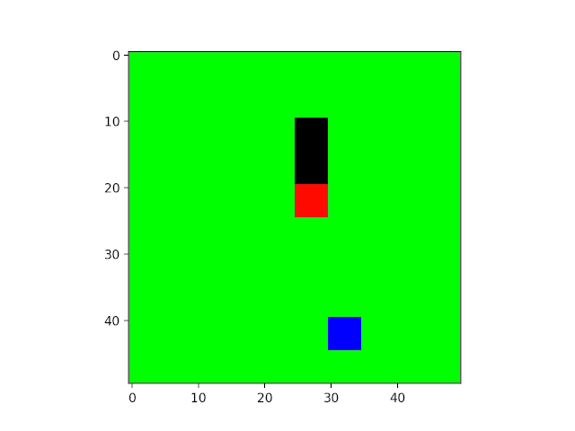

# Deep Q Reinforcement Learning

## Description
Reinforcement learning can be used as a technique to train an agent to play a game in a given enviroment. Q-learning is a simple type of reinforcement learning, whereby a "Q-table" is created and contains the AI's estimates of the "quality" (hence the name) of each action available to the agent in each game state. As the agent plays the game and collects more information, it updates the Q-table with new estimages. Q-learning is simple and effective, but not scalable - in all but the most simple games, the state space (i.e. the number of all possible combinations of environment states) becomes too large for a simple look-up table to be effective. 

The Q table is really just a method of estimating the Q-function. That is, a function that takes the game state and an action as its inputs, and returns an estimate of the quality of that action as an output. Another method of doing this is to use convolutional neural networks to estimate all possible action values for a given game state. This combination of Q learning with deep learning is call a Deep Q Network (DQN). The advantage of DQNs is (a) we do not need to store an impossibly large Q-table to play a moderately complex game, and (b) neural networks are good at finding patterns, so it doesn't need to have previously encountered an exact version of a game frame in order to be able to generalize the model to make a decent guess at the answer.

This repository contains my implementation of a Deep Q Network to play the game Snake. It is worth noting a few things:
- The agent is only supplied with the game screen of each frame as a 3-dimensional (RGB) pixel array, a positive or negative reward for each game screen, and a set of possible actions to take. 
- It does NOT know what the pixels represent. I.e. it doesn't start out knowing what a "snake" is, or that the food is good and crashing is bad. 
- It does NOT know what each action represents. It doesn't know what "up", "down", "left" or "right" do in the context of the game. 
All it knows is that the pixel array changes with each game screen, that the actions may or may not affect how the pixels change, and that sometimes the game score changes - but it doesn't know what actions or (sequences of actions) cause this. From this input, the agent plays millions of game screens and eventually learns to win the game. 

Below is an animation of the AI in this repo after 2 million game frames of training (approximately 20 hours on my GPU-enabled laptop).

## Dependencies
- Gym
- [Gym_snake](https://github.com/grantsrb/Gym-Snake)
- Matplotlib
- Tensorflow (tested with tensorflow-gpu==2.0.0b1)
- Numpy

## Usage:
Clone this repository. From the command like, execute the following to see all flags and options:

> $ python DQN_snake.py --help

To train the model with default parameters (default of 1,000,000 frames, 6 - 8 hours on my laptop), use the '-m'

> $ python DQN_snake.py -m train

To train the model on a different number of frames, use the '-n' flag:

> $ python DQN_snake.py -m train -n 2000000

To test the model on untrained weights and biases, use the '-m' flag (expect poor performance):

> $ python DQN_snake.py -m test

To supply a trained model file for evaluation, use the '-f' flag:

> $ python DQN_snake.py -m test -f snake.h5

To edit hyperparameters, change the class variables in thier definition near the top of the DQN_snake.py file.

## TO DO:

- The current model works, but it quite inefficient with memory. Each state (int8 array) is stored twice - once as the resulting state of one transition, and then again as the starting state of the next. I would like to implement a circular buffer system with indexing to allow storing of each frame only once. However, this presents complications around how to handle what happens when an episode ends - you dont want the last frame of the previous episode to be included as the starting frame for a new episode.

- Possibly move all hyperparameters to a separate file, save in JSON format

- Improve the model to use Double-DQN, Dueling DQN, etc.
 
